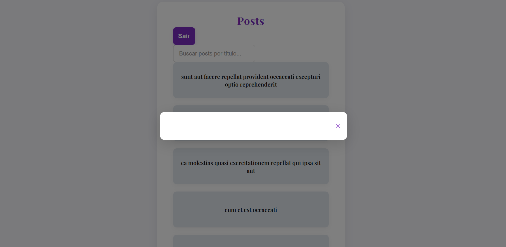
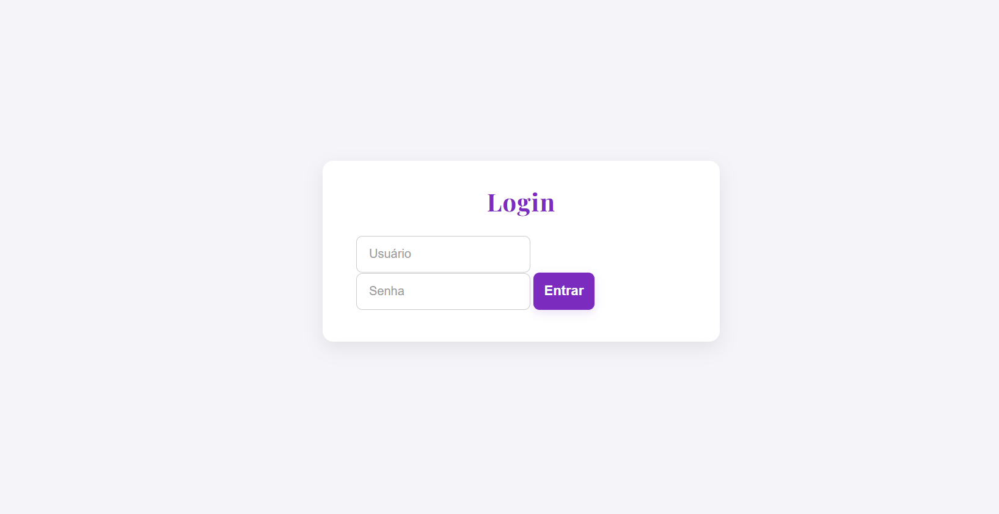

# Desafio Front-end - Nível Jr

## Objetivo

Avaliar suas habilidades em desenvolvimento web front-end. O desafio consiste em criar uma interface moderna e responsiva que consome APIs públicas, exibe dados em listas e detalhes, e implementa autenticação de usuário.

---

## Tecnologias

- **Linguagens:** HTML, CSS, JavaScript (ou TypeScript)
- **Frameworks/Libraries:** Permitido uso de bibliotecas leves como React, Vue.js ou Bootstrap (opcional)
- **APIs:**
  - [JSONPlaceholder](https://jsonplaceholder.typicode.com/) – para dados de posts
  - [DummyJSON](https://dummyjson.com/docs/auth) – para autenticação de usuários

---

## Funcionalidades

### 1. Tela de Login

- Campos para usuário e senha
- Autenticação via [DummyJSON](https://dummyjson.com/docs/auth) (`/auth/login`)
- Armazenamento seguro das credenciais (ex: LocalStorage)
- Estratégia de refresh token para manter o usuário logado
- Botão de logout

### 2. Listagem de Posts

- Exibição dos posts em cards, mostrando o título
- Dados obtidos de `/posts` da API JSONPlaceholder

### 3. Detalhes do Post

- Ao clicar em um card, abrir um modal com título e corpo do post
- Dados podem ser passados da listagem ou buscados em `/posts/:id`

### 4. Busca de Posts

- Campo de busca para filtrar posts pelo título em tempo real

### 5. Responsividade e UX

- Interface responsiva para desktop e mobile
- Uso de Flexbox, Grid e media queries para melhor adaptação

---

## Estrutura Sugerida do Projeto

```
/index.html
/pages/
  login.html
  posts.html
/styles/
  main.css
/scripts/
  login.js
  posts.js
```

- Os arquivos já estão criados, mas você pode reorganizar conforme necessário.
- A folha de estilos `main.css` já está vinculada, mas você pode criar outras se desejar.
- Use sua criatividade para definir fontes e paleta de cores.

---

## Critérios de Avaliação

- **Qualidade do código:** Clareza, organização, manutenibilidade e boas práticas
- **UI/UX:** Interface limpa, intuitiva e responsiva
- **Funcionalidade:** O app deve atender a todos os requisitos acima

---

## Como Entregar

1. Faça um fork deste repositório
2. Implemente sua solução
3. Faça commits frequentes e claros
4. Envie o link do seu repositório para avaliação

---


